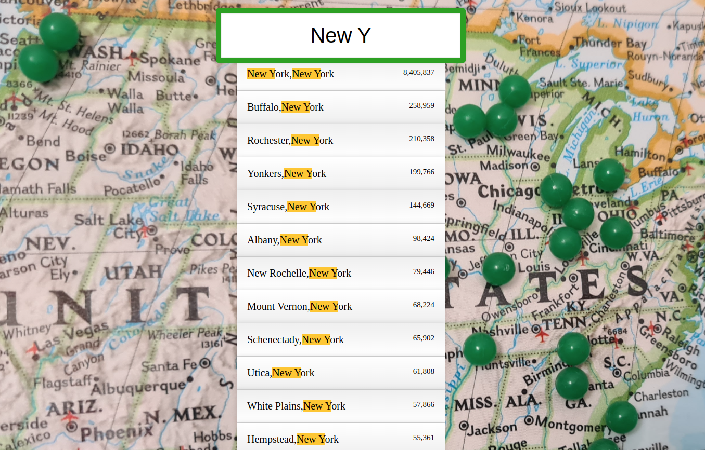

Welcome! 

Come join me on my journey of Wes Bos's 30 Day Vanilla JS Code Challenge! Where I build 30 things in 30 days with 30 tuturials~
<br></br>
### Day 6 Challenge of Javascript30

## Type Ahead

In this challenge, users can type into the searchbar and search for a city or state in the US and displays the city, state and population. As the user types, the corresponding letters are highlighted. 



----
### What I learned/refresher:

- fetch
  
  used to retrieve data from a url which results in a JSON data source.

  ```js
  fetch(endpoint).then(blob => blob.json());
  ```
  this will return a promise, that can be resolved.

- RegExp

  object is used for matching text with a pattern

Starter code from [Javascript 30 Challenge](https://github.com/wesbos/JavaScript30)